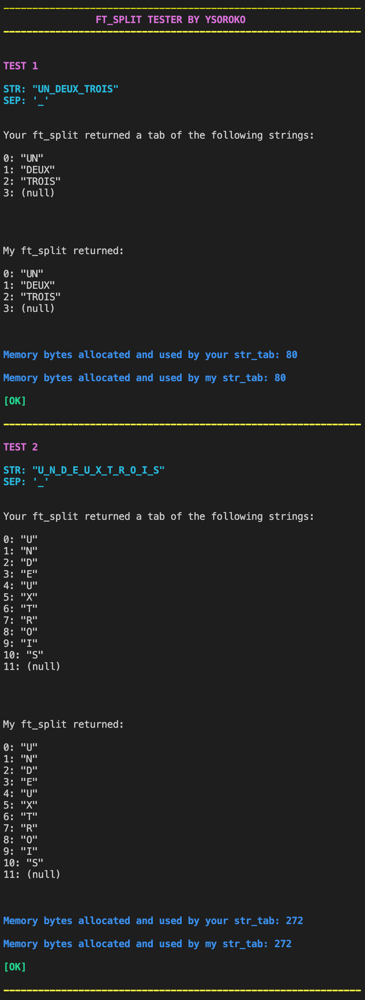

# FT_SPLIT_TESTER
A small tester for a troublesome function ft_split for s19 coding school

Features:
- 16 Tests for every possible situation your ft_split will ever encounter
- Memory log which tracks how many bytes of memory you used for each test and compares it to my ft_split
- The tests compare your output with the right output and show you if your ft_split is working right

SETTING UP:
1) Git clone this repo anywhere you want

2) a) In Makefile, replace the first line next to SRCS by a path to your own ft_split.c file (Example: /Users/ysoroko/Cursus/libft/ft_split.c \)
   
   
3) a) For MacOs, ignore this part, everything is already set up for the tester to count the memory used.

   b) For GLIBC (Linux) terminal, in libft.h file line 19 should be changed to: #define MALLOC_SIZE_FUNCTION malloc_usable_size 
      and line 23 should be changed to #include <malloc.h>
      
   c) For Windows terminal, in libft.h file line 19 should be changed to: #define MALLOC_SIZE_FUNCTION malloc_usable_size
      and line 23 should be changed to #include <malloc.h>
      

RUN:
- Type "make" command in the terminal to compile
- Type "make results" in the terminal after the compiling to launch the code and check the results
